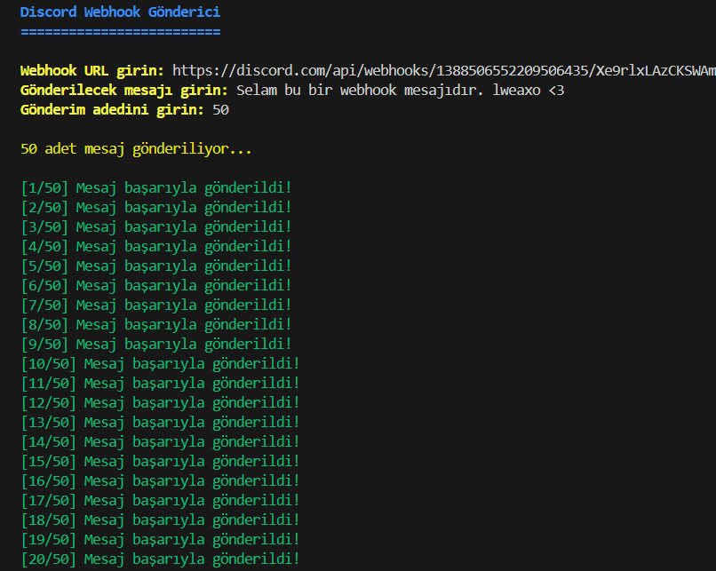
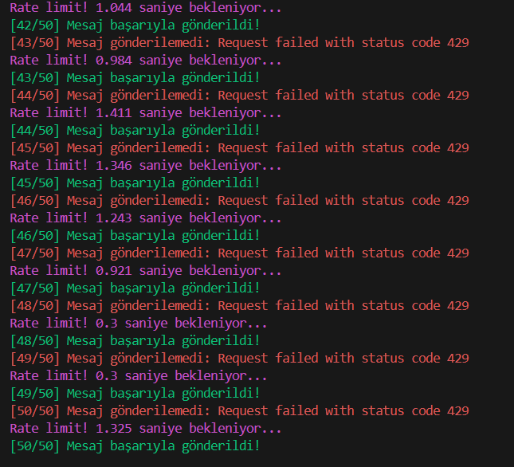
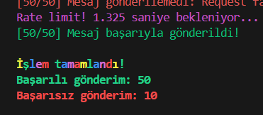

# 📢 Discord Webhook Gönderici



**Hızlı Discord Webhook Mesaj Gönderici**

---

## 🌟 Özellikler

✔️ **Hızlı Mesaj Gönderimi**  
✔️ **Rate Limit Atlatma**  
✔️ **Renkli Konsol Arayüzü**  
✔️ **Türkçe Dil Desteği**  
✔️ **Detaylı Raporlama**  



---

## 🛠️ Kurulum

1. **Node.js Kurulumu**  
   [Node.js resmi sitesinden](https://nodejs.org/) indirin ve kurun.

2. **Gerekli Paketlerin Kurulumu**  
   ```bash
   npm install axios colors
   ```

---

## 🚀 Kullanım

1. **Programı Çalıştırın**  
   ```bash
   node index.js
   ```

2. **Bilgileri Girin**  
   - Webhook URL
   - Gönderilecek mesaj
   - Gönderim adedi



---

## ⚙️ Teknik Detaylar

| Özellik | Değer |
|---------|-------|
| Dil | JavaScript |
| Modüller | axios, colors |
| Rate Limit Önleme | 100ms otomatik delay |
| Hata Yönetimi | Otomatik retry |

---

## ❓ Sıkça Sorulan Sorular

**S:** Webhook neden çalışmıyor?  
**C:** URL'nin `https://discord.com/api/webhooks/` ile başladığından emin olun.

**S:** Rate limit hatası alıyorum ne yapmalıyım?  
**C:** Program otomatik olarak bekleyecektir, elle müdahale gerekmez.

---

## 📜 Lisans

MIT Lisansı - [Detaylar için tıklayın](LICENSE)

---

## 👨‍💻 Destek & İletişim
 
[](https://discord.gg/h7YAermnyw) 

---

> **⚠️ Uyarı:** Discord'un kullanım şartlarına aykırı şekilde kullanmayın. Bu araç sadece eğitim amaçlıdır.